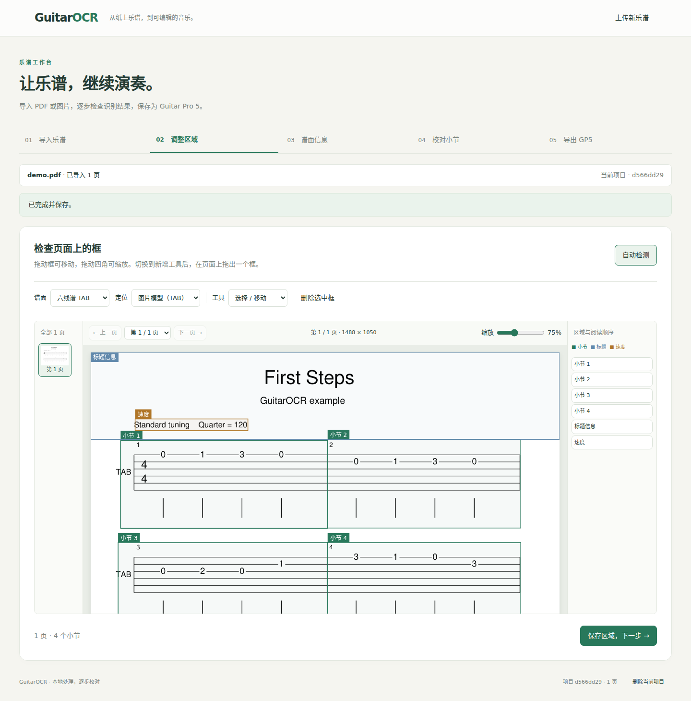

# GuitarOCR

把吉他谱 PDF 或图片转换为可编辑的 GP5 文件。在本地网页中检查小节框、校对音符，再下载到 Guitar Pro 中继续编辑。

支持六线谱 TAB、五线谱和五线谱＋TAB，默认自动判断谱面类型。当前模型主要适用于规则排版的吉他单轨谱，手写、透视照片和复杂总谱尚需更多验证。识别结果需要对照原谱校对，效果和已知错误见[评测报告](docs/training-v3-report.md)。



## 下载

下载 [GuitarOCR-0.1.0.zip](https://github.com/Flurry-L/guitarOCR/releases/download/v0.1.0/GuitarOCR-0.1.0.zip)，完整解压到可写文件夹。包内包含当前版面模型和两套 OCR 适配器，无需 Git。Windows 用户可先看包内的「使用说明.txt」。

请下载名为 GuitarOCR 的 ZIP；GitHub 自动生成的 Source code.zip 是源码归档。

## 启动

Windows 双击 **`start.bat`**；Linux x64 在项目目录运行：

```bash
bash start.sh
```

首次启动会安装 Python 3.11、依赖和 GLM-OCR 基座，校验权重后打开 **http://127.0.0.1:7860**。需要联网下载数 GB，建议预留 20 GB 磁盘空间。中断后重跑同一脚本即可，使用期间保留启动窗口。

NVIDIA 驱动 580 或更新版本可自动启用 GPU，否则使用 CPU。无需提前安装 Python 或 CUDA Toolkit。Linux CPU 和 H100 已实测；Windows 提供脚本与 CI，完整安装仍需实机验收。详细参数和手动安装见[安装说明](docs/setup.md)，安装失败见[故障排查](docs/troubleshooting.md)。

## 转换乐谱

1. **导入乐谱**：上传 PDF 或图片，多文件可调整顺序。
2. **调整区域**：自动检测小节框，修正位置、阅读顺序和谱面类型。
3. **谱面信息**：读取并核对曲名、作者、调弦和速度。
4. **校对小节**：识别音符和节奏，对照裁图修改并保存。识别失败的小节需检查确认。
5. **导出 GP5**：生成并下载文件，也可下载项目备份，稍后继续编辑。

可先用自编[示例 PDF](examples/demo.pdf)或[示例图片](examples/demo.png)试用，与[预期 GP5](examples/expected.gp5)对照。停止后继续识别、局部重试和备份恢复见[工作台使用说明](docs/webui.md)。转换 PDF 或图片无需安装 Guitar Pro，生成训练数据时才使用它。

## 获取源码

需要修改代码或训练模型时，可通过 Git 获取完整仓库。Windows 先安装 [Git for Windows](https://gitforwindows.org/) 和 [Git LFS](https://git-lfs.com/)，然后打开 PowerShell。Ubuntu / Debian 使用终端安装：

```bash
sudo apt-get update
sudo apt-get install -y git git-lfs curl ca-certificates libgl1 libglib2.0-0
```

在可写目录中执行（Windows 和 Linux 相同）：

```bash
git lfs install
git clone --depth 1 --single-branch --branch agent/guitar-pro-end-to-end https://github.com/Flurry-L/guitarOCR.git
cd guitarOCR
git lfs pull
```

GitHub 的源码 ZIP 可能只含权重指针，且缺少安装器补下载所需的 Git 信息，请使用上述克隆方式。

## 命令行与开发

完成[模型推理环境安装](docs/setup.md#手动安装模型推理)后运行：

```bash
uv run --no-sync guitarocr-gp examples/demo.pdf --output output/demo
uv run --no-sync guitarocr-check --hashes
```

运行时有三项任务模型：一套 PP-DocLayoutV3 定位并判断谱面类型，两套 GLM-OCR LoRA 分别读取谱面信息和小节，共用一个基座。模型版本、下载与校验见[模型说明](weights/README.md)。

| 需要做什么 | 文档 |
| --- | --- |
| 了解代码结构和步骤接口 | [处理流程](docs/workflow.md) |
| 编辑或导入小节文本 | [格式参考](docs/score-text.md) |
| 从 Guitar Pro 生成训练数据 | [数据生产](docs/data.md) |
| 训练和评测模型 | [训练说明](docs/training.md) |
| 修改代码、运行测试、打包 | [参与开发](CONTRIBUTING.md) |
| 查看实测环境与结果 | [验证记录](docs/validation.md) |

项目许可证尚未选定。模型、训练素材和第三方组件的授权状态见[第三方说明](THIRD_PARTY_NOTICES.md)，发布待办见[审核记录](docs/open-source-audit.md)。
