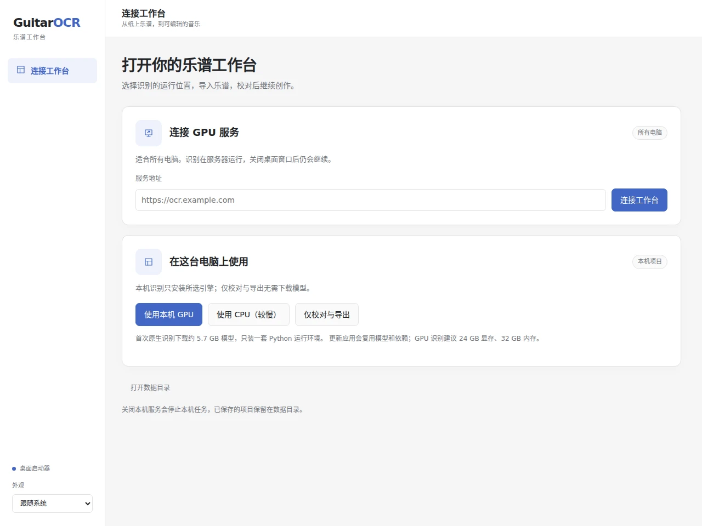

# 安装与启动

从[发布页](https://github.com/Flurry-L/guitarOCR/releases)下载对应系统的安装包，以附件标注的系统要求为准。打开应用后点击「打开乐谱」。



可以先打开内置示例练习编辑，或恢复项目 ZIP。导入 PDF／图片并开始识别时，应用会提示下载约 1.8 GB 模型。建议至少 8 GB 内存、6 GB 可用磁盘；大谱面需要更多内存。

## 设备选择

| 设备 | 本机识别 |
| --- | --- |
| Windows、Linux x64 | CPU；CUDA 版本可使用 NVIDIA GPU |
| macOS Apple Silicon | Apple GPU |
| macOS Intel | CPU |
| 手机 | 浏览器连接[自托管服务](server.md) |

应用自动选择可用设备，可在「设置」查看。CPU 识别较慢，实际速度取决于设备和乐谱大小。Windows 需要 WebView2，macOS 要求 13.4 或更新版本；Linux 的系统要求见安装包说明。

已有服务器时，在启动页展开「连接服务器」，填写服务地址。乐谱在服务器处理，本机无需下载模型；关闭网页后任务仍会继续。

## macOS 首次打开

M 系列 Mac 下载 `GuitarOCR_0.1.0_aarch64.dmg`；Intel Mac 下载 `GuitarOCR_0.1.0_x64.dmg`。

当前安装包未使用 Apple Developer ID 签名和公证。若从本项目发布页下载后提示「已损坏」或无法打开，先把 `GuitarOCR.app` 拖到「应用程序」，再在终端执行：

```bash
xattr -dr com.apple.quarantine /Applications/GuitarOCR.app
```

重新打开应用即可。该命令解除这份应用的下载隔离标记。

## 保存与更新

编辑保存到运行识别的设备上：本机模式保存在这台电脑，远程模式保存在服务器。启动页的「打开数据文件夹」可查看本机项目、模型和日志。

更新应用会继续使用已有项目和模型。移动到另一台设备时，在「导出」下载项目 ZIP，再从新设备的「恢复项目备份」导入。

退出桌面应用会停止本机识别；已保存的结果保留，可从「项目」继续处理。

[操作说明](webui.md) · [自托管部署](server.md) · [从源码构建](native-packaging.md)
