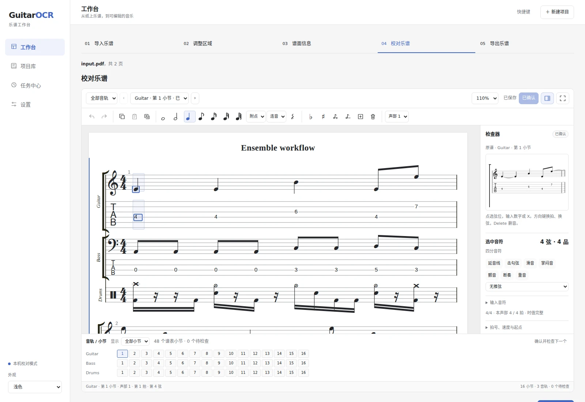

# 使用说明

## 导入

选择或拖入 PDF、PNG、JPG、BMP、TIFF。多文件按列表顺序合并为一个项目，可在开始前调整顺序。PDF 和多页 TIFF 会自动展开，页数和大小限制显示在导入按钮上方。

点击「开始识别」，完成后进入校对。需要先调整小节位置时，选择「先导入，手动检查区域」。

「打开示例」载入 Harbor Light：吉他与贝斯双轨、八小节的预置乐谱，可直接练习编辑和导出。它不代表模型识别结果。每次打开都会创建独立项目。

「项目」集中显示保存的乐谱及识别进度，可搜索、按状态筛选和排序，也可停止识别或继续中断的处理。选择「新建项目」导入另一份乐谱。

## 校对

在顶部选择音轨和小节，右侧对照原谱。点击原图可放大，窄屏下通过「原谱」按钮打开。

- **TAB**：点击弦位，用数字键输入品位，`X` 表示闷音。上下键换弦，左右键换拍。
- **五线谱**：双击谱表空位添加音符；选中音符后可拖动，或用升降半音按钮和音高栏修改。
- **鼓谱**：点选鼓音，在鼓件栏更换或添加鼓件。

工具栏可修改时值、附点和连音，右键菜单可复制、粘贴、增删音符或拍。删除和弦中的最后一个音符后，该拍保留为休止符。更改时值会移动后续音符。

展开「音轨 / 小节总览」可快速定位小节，筛选待检查或已确认的内容。红色 × 表示识别失败或节奏冲突，黄色 ! 表示需要核对音高、移调等信息；原谱旁会说明具体原因。

「保存」或 Ctrl / ⌘ S 保存修改；「确认并继续」表示已经对照原谱核对，保存后进入下一个尚未确认的小节。也可选择「跳过，检查下一个」。切换小节和导出前会先保存有效修改，失败时保留草稿。

右侧可编辑延音、击勾弦、滑音、掌闷音、颤音、断奏、重音和推弦。展开「小节与节拍设置」可修改拍号、速度、声部和起点；起点以四分音符拍数计算，从 0 开始。其他字段通过「高级：小节文本」编辑，格式见[乐谱表示](score-text.md)。

选中一拍后，在「当前拍的和弦标记」中编辑和弦名和指法图。品位和指法按低音弦到高音弦填写；横按 `1:6-1` 表示第一品从第六弦按到第一弦。原谱和弦标注可插入选中的拍，不会自动放到第一拍。

点击专注编辑按钮可扩大谱面，按 Esc 退出。快捷键见编辑器顶栏「快捷键」。

## 修正区域与谱面信息

在顶栏「区域与信息」中打开相应页面。

**区域修正**：蓝色框对应小节，混合谱的五线谱和 TAB 应放在同一个框中。谱头、速度、谱号和标记分别框选。拖动可移动区域，四角可缩放；工具栏支持新增、删除、撤销和重做。选中框后可调整阅读顺序或输入精确坐标。修改后「保存并继续」，或「放弃修改」恢复已保存内容。

**谱面信息**：核对曲名、作者、乐器和速度。多轨乐谱可分别选择音轨，修改名称、音色、调弦和变调夹。速度对整份乐谱生效。

调弦按第 1 弦到低音弦排列。自定义调弦填写 MIDI 音高编号，例如五弦贝斯为 `43,38,33,28,23`。仅有五线谱时，弦数和调弦需要自行确认。

「记谱移调」是实际音高减去谱面音高，例如降 B 调小号填 `-2`；留空时采用谱面读取的说明。8va／8vb 按印出的范围生效。

| 修改 | 对已有结果的影响 |
| --- | --- |
| 区域或谱面类型 | 需要重新读取谱面信息和识别小节 |
| 乐器、调弦、记谱移调 | 需要重新识别小节，保存前会提醒 |
| 曲名、作者、速度 | 保留音符，重新导出 |
| 变调夹 | 需核对音高并重新导出 |
| 小节内容 | 重新导出；跨小节连线需同时检查邻近小节 |

重新识别整谱、单个小节或待检查小节，会替换对应的人工编辑。失败或停止识别会保留已有结果。

## 导出与恢复

「导出」提供三种主要文件：

| 格式 | 用途 |
| --- | --- |
| GP5 | 在 Guitar Pro 等支持 GP5 的软件中继续编辑 |
| MusicXML | 在其他打谱软件中打开 |
| 项目 ZIP | 保留原图、识别结果和校对状态，在 GuitarOCR 中继续编辑 |

「更多格式」提供乐谱 JSON 和小节文本。GP5 无法表示的文字会有提示，项目 ZIP 保留原文。

将项目 ZIP 放入「恢复项目备份」即可继续编辑。切换项目或导入失败时，当前修改保留；放弃修改后才会被替换。同一项目在多个窗口编辑时，旧版本不能覆盖新版本；遇到冲突，先复制需要保留的内容，再载入最新项目。
